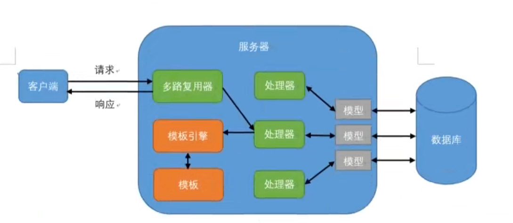
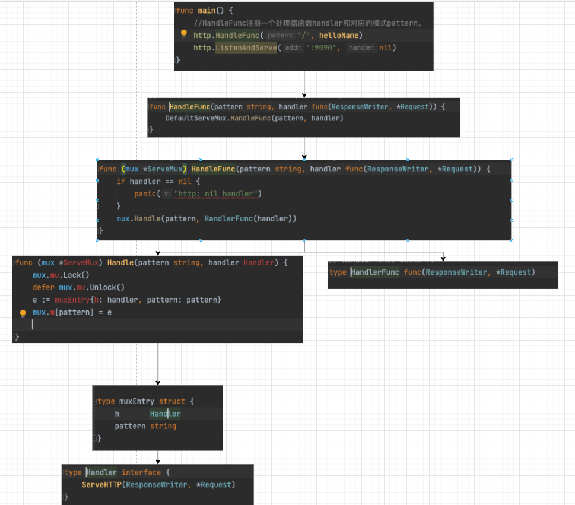

# goWebTrying
#### web应用的工作原理

Handler 是一个接口，但是 helloName 函数并没有实现ServeHTTP 这个接口，为什么能添加呢？

原来在 http 包里面还定义了一个类型 HandlerFunc,

我们定义的函数 helloName 就是这个 HandlerFunc 调用之后的结果，这个类型默认就实现了 ServeHTTP 这个接口，

即我们调用了 HandlerFunc (f), 强制类型转换 f 成为 HandlerFunc 类型，这样 f 就拥有了 ServeHTTP 方法。

#### 什么是HandleFunc？

http包下的HandleFunc注册一个处理器函数handler和对应的模式pattern。

在demo01中handleFunc中 绑定根目录      /    与处理器函数 helloName

在该函数下，会执行==DefaultServeMux.HandleFunc(pattern, handler)==方法

其中serveMux就是其中的多路复用器，我们会调用 默认的 多路复用器。它会将每一个接收的请求的URL与一个注册模式的列表进行匹配，并调用和URL最匹配的模式的处理器。ServeMux还会注意到请求的URL路径的无害化，将任何路径中包含"."或".."元素的请求重定向到等价的没有这两种元素的URL

